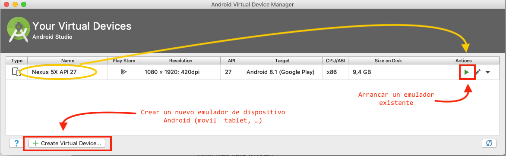
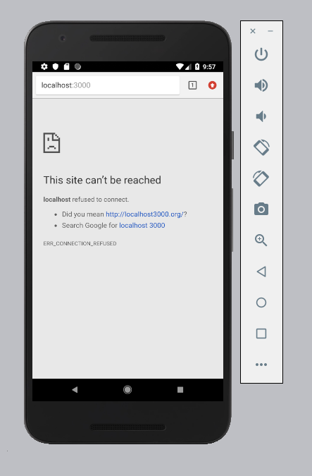
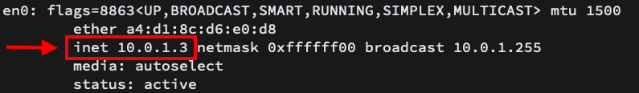
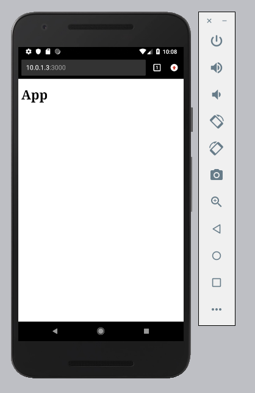
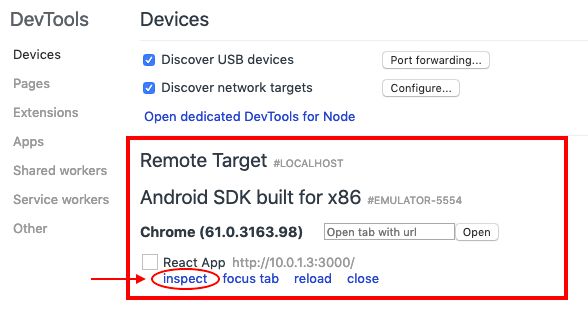
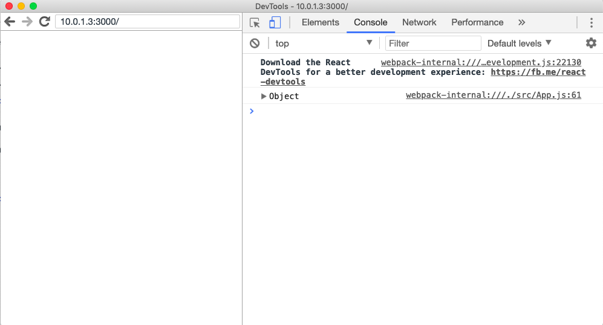

# Cómo arreglar un bug de una webapp en Chrome dentro de un Android desde Mac

Si eres desarrollador web, trabajas en Mac, tienes iPhone y de repente alguien detecta en tu proyecto web un bug que sólo pasa en Android, reproducirlo, debugearlo y arreglarlo se puede convertir en una odisea.

Así que lo primero es ver si somos capaces de acceder a un emulador de Android

## Emulador de Android en Mac

Los servicios más sencillos con los que podemos ejecutar Android desde un Mac diría que son los de pago. Se me ocurren ahora:
- [GenyMotion](https://www.genymotion.com/)
- [BrowserStack](https://www.browserstack.com/)

Para acceder gratuitamente a un emulador de Android en nuestro Mac tenemos que instalar [**Android Studio**](https://developer.android.com/studio)

Una vez instalado, tenemos disponibles diferentes emuladores bajo el nombre de AVD (Android Virtual Device) en el menú: Tools > AVD Manager

Una vez creado el dispositivo Android que necesitemos, lo lanzamos y veremos algo como esto

<video poster="https://developer.android.com/studio/videos/home/emulator-ar-poster.png" autoplay="" loop="" muted="" class="block"><source src="https://developer.android.com/studio/videos/home/emulator-ar.mp4?hl=es-419" type="video/mp4"></video>

## Accediendo a nuestro servidor local desde el emulador

Una vez tenemos el enulador en marcha, abrimos Chrome dentro del emulador. Deberíamos poder acceder sin problema a las direcciones web de producción.

Pero vemos que desde el emulador no podemos acceder a `localhost` 

Para acceder a nuestra URL en desarrollo tenemos que acceder a nuestra IP local que podemos averiguar desde el terminal con el comando `ifconfig`

Con esta IP sí que podremos acceder a nuestro servidor local

## Debugeando nuestra web desde el emulador

Una vez que hemos conseguido abrir nuestra web local en el emulador necesitamos ser capaz de debugear. Chrome dispone de una opción para debugear navegadores "remotos" que podemos utiliza aquí

Abrimos Chrome en nuestro desktop y nos vamos a la "url" → `chrome://inspect` 

En la pantalla que nos sale veremos que entre los dispositivos remotos a los que podemos acceder, nos aparece nuestro emulador. Así si que si le damos a "Inspect" accederemos al inspector de nuestro site que se está ejecutando en Chrome en nuestro emulador de Android

---

### Recursos

- [Debug Websites Within Your Android Emulator Using Chrome DevTools](https://www.webascender.com/blog/debug-websites-within-android-emulator-using-chrome-devtools/)
- [Setup Android Lollipop Emulator on OS X](https://www.webascender.com/blog/setup-android-lollipop-emulator-os-x/)
- [How to connect to localhost from Android Studio emulator](https://stackoverflow.com/questions/42904584/how-to-connect-to-localhost-from-android-studio-emulator)