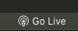
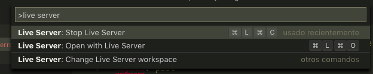
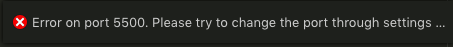

En Visual Code hay un plugin muy útil llamado [Live Server](https://marketplace.visualstudio.com/items?itemName=ritwickdey.LiveServer)

Con este plugin podemos servir cualquier página en un servidor local directamente desde Visual Code




A veces, nos encontramos que después de lanzar el servidor una vez, el proceso se ha quedado abierto escuchando en el puerto por defecto y nos sale este error



Para solucionar este error tenemos 2 vías

## Matar el proceso que está escuchando ese puerto

Con el comando `lsof -i :5500` podemos listar los procesos que esten escuchando al puerto 2000

```
COMMAND     PID              USER   FD   TYPE             DEVICE SIZE/OFF NODE NAME
Code\x20H 46898 juanmanuelgarrido   55u  IPv4 0x12d0e7e8d85c152f      0t0  TCP *:fcp-addr-srvr1 (LISTEN)
```

Con esta información, podemos matar el proceso directamente utilizando su PID → `kill -9 46898`

## Cambiar el puerto por defecto en los settings

También podemos acceder a los [settings de Visual Code ](https://github.com/ritwickdey/vscode-live-server/blob/master/docs/settings.md) y cambiar el puerto en el que se lanza Live Server, dándole un valor (distinto al puerto ocupado) a `liveServer.settings.port`


